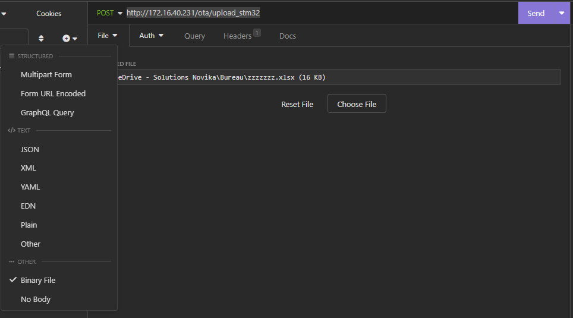

# Webpage

All assets related to the webpage are bundled using an utility.
It is important to ensure the bundled resources are up to date.
Up regenerate the asset packages, run this command:

> .\embeddedgen.bat

All webpage made for casual user a prefixed with 'user-', those made for advanced user are prefixed 'mnt-'.

# End Points

'/' and '/index.html' are automatically redirected to 'user-index.html' by default.

| File Name | Description | User | Maintenance |
|-------|------|------|------|
| /index.html | Main page, where a casual user will land | YES | YES |
| /api/access-maintenance-redirect | API to enter the password to access the maintenance mode. | YES | YES |
| /api/pairingsettings | Get/Set pairing settings | YES | YES |
| /api/getsettingsjson | Get all ESP32 settings | NO | YES |
| /api/setsettingsjson | Set all ESP32 settings | NO | YES |
| /api/wifisettings | Get/Set Wifi-Settings (* Cannot get the password) | YES | YES |
| /action/reboot | Reboot the ESP32 | YES | YES |
| /action/downloadconfig | Force to redownload the STM32 parameter file |  NO | YES |
| /action/checkotaavailability | Check if an OTA is available | YES | YES |
| /action/installota | Install an OTA if available | YES | YES |
| /api/getsysinfo | Get system informations | NO | YES |
| /api/getlivedata | Get live datas | NO | YES |
| /api/serverparameterfile | Get/Set the STM32 parameter file | NO | YES |
| /ota/upload_stm32 | Upload a new firmware into the STM32 using the UART | NO | YES |
| /ota/upload_esp32 | Upload a new firmware into the ESP32 | NO | YES |

## Upload new FW to STM32

You can test the upload to STM32 using 'Insomnia' or 'Postman'.
No webpage page has been created yet.

NOTE: The access is restricted, you may need to enter the 'Troubleshoot' password unless it is deactivated

Refer to: [Whitebox](./Whitebox.md) for more details.

http://172.16.40.231/ota/upload_stm32

