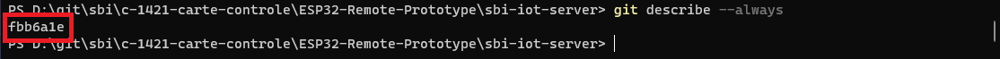
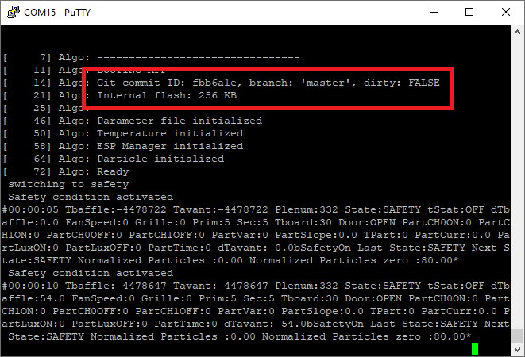
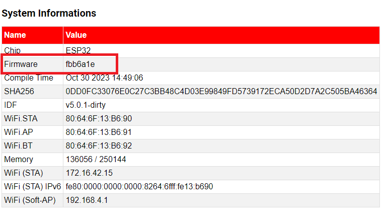

# Git Hash

On startup, the STM32 will print the git commid ID and branch.
It allows to know what program is running and what code was used for the binary file.

Using the git describe command in the source code folder:

In debug serial on the STM32 :

On the webpage on the ESP32 :

