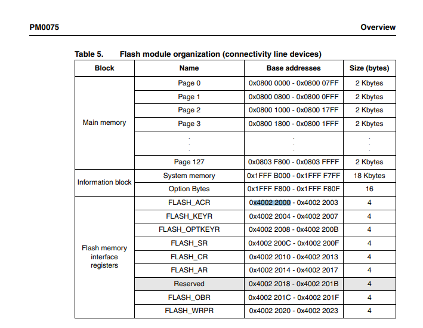

# Parameters

## Goal

We want to save parameters into memory. We don't have an hardware EEPROM so we will use the internal flash.

### Caveat

- Shouln't write too often or it will burn the flash page (10 000 write cycle before burning it out.)
- Slow to write
- Needs to ensure software update won't overrite it.
- 2 KB sector minimum size as minimum erasure

The product may needs to be updated into the future, a bootloader will be required.
It may even need dual boot to be fail-safe but it's to be determined.

# MCU capability

The MCU allows to have multiple programs in parallel into the same flash memory. The only obstacle is having enough memory for every one of them.

## Memory layout

According to the documentation, the STM32F105RCTX have access to 256KB flash, divided into 128x 2KiB page.
Thise is an except from the manufacturer documentation.

# Suggested solution

Partition the flash memory with some future proofing.
Partition layout could looks like this:

NOTE: Address doesn't start at 0, refer to the datasheet for more details.
Nothing here is final, it's still suggested.

| Partition name | Start page | Page count | Description
|---|---|---|---|
| Bootloader | 0 | 30 (60 KiB) | Reserved for the bootloader program
| APP0 | 30 | 47 (94 KiB) | Main application, location 0
| APP1 | 77 | 47 (94 KiB) | Main application, location 1
| PARAM | 124 | 3 (12 KiB) | User parameters or calibration
| BOOT-INFO | 127 | 1 (2 KiB) | The bootloader can use this to store boot related information (like CRC32, location etc...)

