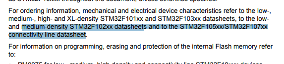
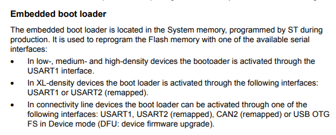
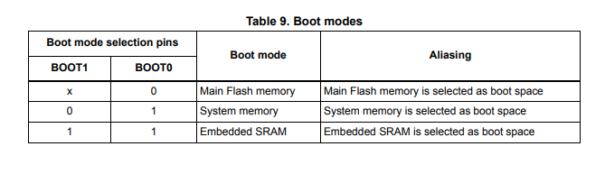

# STM32 Bootmode

In this table, system memory represent the internal bootloader used to program the STM32 using the UART.
We are using a connectivity density STM32 microncontroller, so UART1 should be used.

